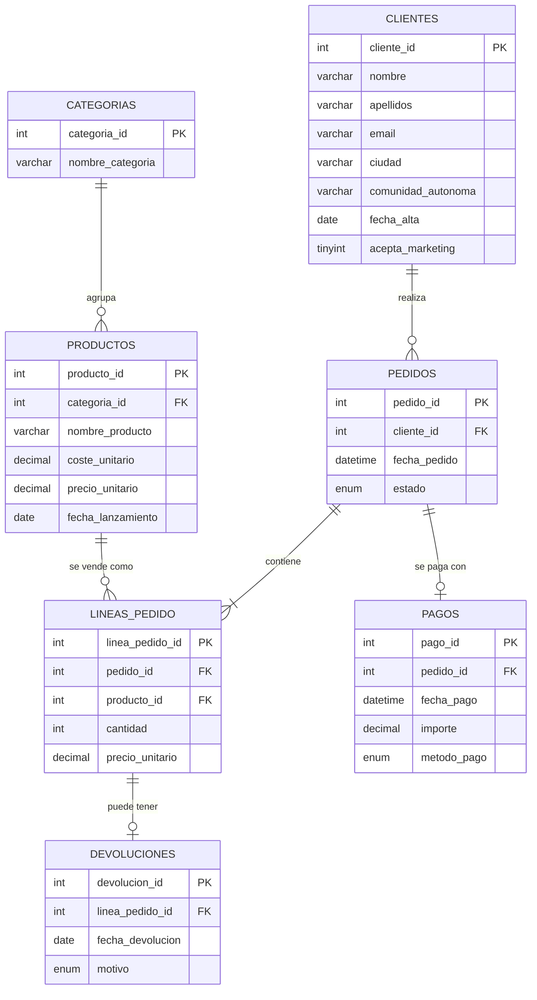

# Portfolio de Analítica SQL

Un proyecto SQL autocontenido que simula una tienda online española de tamaño medio,
diseñado para responder al tipo de preguntas de negocio que le harían de
verdad a un analista de datos: tendencias de ingresos, segmentación de
clientes, riesgo de fuga, margen de producto y tasas de devolución.

Todo —esquema, ~20.000 filas de datos sintéticos pero realistas, y 17
consultas analíticas— es MySQL puro. Sin dependencias externas: clonas,
ejecutas tres archivos, y consultas.

## Por qué este proyecto

La mayoría de los repos de "portfolio SQL" son un único archivo con
`SELECT * FROM tabla LIMIT 10`. Este está estructurado como un trabajo de
analítica real:

- Un **esquema normalizado** (7 tablas, claves foráneas correctas,
  restricciones e índices).
- **Primero las preguntas de negocio, después el SQL** — cada consulta en
  [`sql/03_consultas.sql`](sql/03_consultas.sql) responde a una pregunta
  que haría un stakeholder, no es "aquí un ejemplo de JOIN".
- **Funciones de ventana usadas para lo que sirven**: crecimiento mes a
  mes (`LAG`), totales acumulados, puntuación RFM de clientes (`NTILE`),
  top-N por grupo (`RANK`).
- **Objetos reutilizables**: una vista (`vista_valor_vida_cliente`) y un
  procedimiento almacenado (`obtener_historial_pedidos_cliente`) — lo que
  de verdad entregaría un equipo de analítica.
- **Justificación de índices**: un `EXPLAIN` al final demuestra que el
  índice compuesto se usa de verdad, no solo que está declarado.

## Esquema



## Puesta en marcha

Requiere MySQL 8.0+ (usa funciones de ventana, CTEs y restricciones `CHECK`).

```bash
mysql -u root -p < sql/01_schema.sql
mysql -u root -p < sql/02_datos_ejemplo.sql
mysql -u root -p tienda_online < sql/03_consultas.sql
```

`02_datos_ejemplo.sql` genera los datos de forma procedural (no hay que
descargar ningún CSV): 500 clientes, ~110 productos en 10 categorías,
~6.000 pedidos, ~14.000 líneas de pedido, pagos coherentes con esas líneas,
y una tasa de devolución realista de ~4%. Al final imprime el recuento de
filas de cada tabla para confirmar que la carga funcionó.

## Preguntas de negocio respondidas

Organizadas en [`sql/03_consultas.sql`](sql/03_consultas.sql) de lo más
básico a lo más avanzado:

**Ingresos y productos**
- Ingresos totales, número de pedidos y ticket medio de pedidos completados
- Ingresos y unidades vendidas por categoría
- Top 10 productos por ingresos *y* por margen bruto
- Ingresos por cliente por comunidad autónoma (normalizado, no solo el total)

**Series temporales**
- Evolución mensual de ingresos
- Tasa de crecimiento mes a mes (función de ventana `LAG`)
- Ingresos acumulados (running total)
- Retención por cohorte de alta: qué % de los clientes nuevos de cada mes
  sigue comprando 6 meses después

**Segmentación de clientes**
- Segmentación RFM completa (Recencia / Frecuencia / Valor Monetario)
  usando `NTILE(4)`, etiquetando a los clientes como Campeón / En riesgo /
  Perdido / Regular
- Top 3 clientes por gasto *por comunidad autónoma* usando `RANK()`
- Lista de riesgo de fuga: clientes inactivos desde hace 90+ días

**Calidad de producto y devoluciones**
- Tasa de devolución por categoría (saca a la luz problemas de calidad
  que unas ventas brutas altas podrían estar ocultando)
- Productos de margen alto y baja rotación — candidatos a promoción
- Bestsellers fiables que nunca se han devuelto

**Objetos reutilizables**
- `vista_valor_vida_cliente` — una vista para que herramientas de BI la
  consulten directamente
- `obtener_historial_pedidos_cliente(cliente_id)` — un procedimiento
  almacenado para consultas de soporte o dashboards
- Salida de `EXPLAIN` que demuestra que el índice compuesto sobre
  `pedidos(cliente_id, fecha_pedido)` se usa de verdad en ese patrón de consulta

## Resultados y hallazgos

Salida real de ejecutar el proyecto sobre el dataset generado (500 clientes,
~6.000 pedidos): **5.283 pedidos completados, 1.379.549,13 € de ingresos,
261,13 € de ticket medio** (**P1**).

### Segmentación RFM (P9)

| Segmento | Clientes | % clientes | Ingresos | % ingresos |
|---|---:|---:|---:|---:|
| Campeón | 122 | 24,4% | 449.864,24 € | 32,6% |
| En riesgo (alto valor) | 75 | 15,0% | 294.156,73 € | 21,3% |
| Perdido / Fugado | 149 | 29,8% | 287.547,29 € | 20,8% |
| Nuevo / Prometedor | 101 | 20,2% | 227.147,38 € | 16,5% |
| Regular | 53 | 10,6% | 120.833,49 € | 8,8% |

**Lectura de negocio:** los "Campeones" son solo el 24% de la cartera pero
generan el 33% de los ingresos — la concentración de valor esperable. El
dato que de verdad justificaría una acción es otro: el segmento **"En
riesgo (alto valor)"** son clientes que históricamente han gastado y
comprado tanto como los Campeones (mismas puntuaciones de frecuencia y
gasto, `puntuacion_f`/`puntuacion_m` = 4) pero llevan más tiempo sin
volver (`puntuacion_r` baja). Son 75 clientes — el 15% de la base — que
representan 294.157 € de historial de compra, prácticamente a la par que
el segmento "Perdido", que triplica en número de clientes (149) pero solo
aporta un 20,8% de ingresos porque su gasto histórico era mucho menor.
Consecuencia práctica: una campaña de reactivación dirigida específicamente
a esos 75 clientes en riesgo tiene mucho mejor retorno esperado por
cliente contactado que una campaña genérica de "clientes que no compran
hace tiempo", porque no todos los inactivos valen lo mismo.

### Tasa de devolución por categoría (P12)

| Categoría | Unidades vendidas | Unidades devueltas | Tasa devolución |
|---|---:|---:|---:|
| Material de Oficina | 2.056 | 47 | 2,29% |
| Electrónica | 4.976 | 112 | 2,25% |
| Libros | 2.586 | 58 | 2,24% |
| Juguetes y Juegos | 2.053 | 41 | 2,00% |
| Deporte y Aire Libre | 3.702 | 74 | 2,00% |
| Alimentación | 2.135 | 42 | 1,97% |
| Moda | 2.580 | 50 | 1,94% |
| Hogar y Cocina | 4.148 | 80 | 1,93% |
| Belleza y Cuidado Personal | 2.550 | 49 | 1,92% |
| Mascotas | 2.105 | 28 | 1,33% |

**Lectura de negocio:** la tasa de devolución se mueve en una banda estrecha
(1,3%–2,3%), sin una categoría que destaque como problemática — no hay una
señal de calidad que perseguir de forma prioritaria. Lo que sí llama la
atención es **Material de Oficina**, con la tasa más alta a pesar de tener
un volumen de ventas relativamente bajo (2.056 unidades frente a las 4.976
de Electrónica): en proporción, es la categoría donde más vale la pena
revisar la ficha de producto o la descripción antes de compra, ya que un
mismo esfuerzo de mejora tiene más impacto relativo ahí que en Electrónica.
**Mascotas**, en el otro extremo, es la categoría más fiable.

## Notas sobre los datos sintéticos

Los datos se generan con `RAND()` dentro de procedimientos almacenados en
`02_datos_ejemplo.sql`, a partir de un catálogo fijo de nombres de
producto realistas, ciudades y comunidades autónomas de España, y
nombres y apellidos comunes en español — para que el resultado parezca
una tienda real y no `cliente_1`, `producto_2`. Al ser generados
aleatoriamente, las cifras
exactas variarán ligeramente entre ejecuciones; las relaciones entre
métricas (p. ej. margen vs. rotación, recencia vs. gasto) se mantienen
igualmente.

## Tecnología

MySQL 8.0 — CTEs, funciones de ventana (`RANK`, `NTILE`, `LAG`),
procedimientos almacenados, vistas, restricciones `CHECK`, índices
compuestos.

## Próximos pasos

- [ ] **Dashboard en Power BI** conectado a `vista_valor_vida_cliente` y a
  las consultas de la Sección 2 (evolución mensual, RFM), para cerrar el
  ciclo de SQL → visualización → decisión de negocio.
